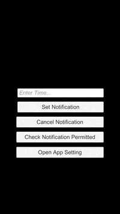

# UniLocalNotification
[](https://unity3d.com/jp/get-unity/download)
[](https://developer.android.com/studio/index.html)
[](https://github.com/sanukin39/UniLocalNotification/blob/master/LICENSE)

---

Simple Local Notification Plugins for Unity

## Description
[UniLocalNotification](https://github.com/sanukin39/UniLocalNotification) - It's a plugin for implementing local notification easily. It can hide processing by platform and register local notification with single code. And several convenient methods are also implemented.

## Example Demo


## Requirement
Unity5 or higher

## Support Platform
iOS, Android

## Usage

### Initialize 
Initialize the plugin. Plese call the method at the beginning of your app every time.

```cs
UniLocalNotification.Initialize();
```

### Register Local Notification 
Register local notification to device. The third argument only use android platform.

```cs
// Notify in 10 seconds
int delay = 10;
UniLocalNotification.Register(delay, "message", "title");
```

### Cancel Local Notification
Cancell all local notifications registered

```cs
UniLocalNotification.CancelAll();
```

### Check Permission
To check whether the user has allowed the notification

```cs
bool isPermitted = UniLocalNotification.IsLocalNotificationPermitted();
```

### Open App Settings
Open application settings (to allow users to register notifications)

```cs
UniLocalNotification.OpenAppSetting();
```

## Install
Use unitypackage under the "UnityPackage" folder.

## Licence

[MIT](https://github.com/tcnksm/tool/blob/master/LICENCE)

## Author

[sanukin39](https://github.com/sanukin39)
